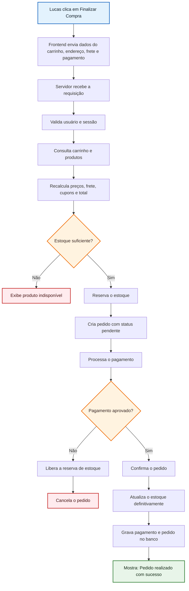

# Fluxograma - Compra de produto na Shopee

> Arquivo pronto para abrir no VS Code com Mermaid.
> Recomendado usar a extensão Mermaid Preview ou Mermaid Viewer no VS Code.

## Como visualizar no VS Code

1. Instale uma extensão de Mermaid, como Mermaid Preview ou Mermaid Viewer.
2. Abra este arquivo `.md` no VS Code.
3. Use o preview do Markdown ou o preview da extensão para renderizar o fluxograma.
